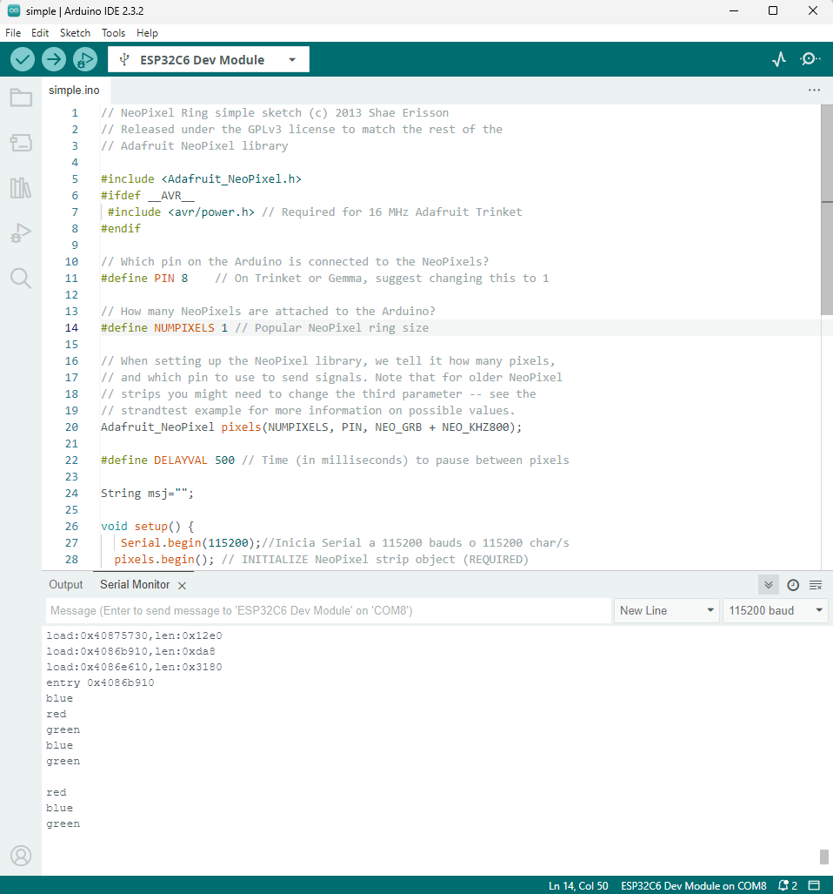

# 📚 Práctica 4: Lectura de Acelerómetro MPU6050 con Arduino

---

## 1) Resumen

- **Equipo / Autor(es):**  _Karen Najera y Arith Maldonado_
- **Curso / Asignatura:** _Elementos programables II_  
- **Fecha:** _01/09/2025_  
- **Descripción breve:** _En esta práctica se implementa un programa en Arduino para leer datos de un acelerómetro y giroscopio MPU6050 mediante comunicación I2C. El sistema recoge información de aceleración en tres ejes (X, Y, Z), velocidades angulares (giroscopio) y temperatura interna del sensor, mostrando los valores por el monitor serial._


---

## 2) Objetivos

- **General:** _Comprender el funcionamiento básico del sensor MPU6050 y su lectura mediante la comunicación I2C en Arduino.._
- **Específicos:**
  - _nicializar correctamente el sensor MPU6050 utilizando la interfaz I2C._
  - _Leer y convertir los datos de aceleración, temperatura y giroscopio_
  - _Mostrar los valores en el monitor serial para su análisis y visualización._

## 3) Alcance y Exclusiones

- **Incluye:** _a práctica se enfoca en la lectura y visualización de los datos del sensor MPU6050, el cual proporciona información útil de aceleración, temperatura y velocidad angular._


-_Los datos se obtienen usando comunicación I2C a través de la librería Wire._

-_La salida de datos es continua y se presenta en el monitor serial cada segundo._

-_No se utiliza ninguna librería externa específica para MPU6050, se accede directamente a los registros del sensor._

-_Los valores obtenidos son procesados para mostrar aceleración en "g", temperatura en °C y giroscopio en °/s.

---

## 4) Resultados

 _lAl ejecutar el programa, el sistema realizó correctamente la lectura de los datos proporcionados por el MPU6050. Se pudo observar cómo los valores de aceleración en X, Y y Z cambiaban al mover el sensor, lo que demostró su correcto funcionamiento. Igualmente, los datos del giroscopio respondieron a los movimientos angulares del dispositivo._

 _La temperatura interna del sensor fue mostrada en grados Celsius, siendo útil para validar que el sensor esté operando correctamente._

**Código**
El programa utiliza la librería Wire.h para establecer la comunicación I2C entre el Arduino y el sensor MPU6050. Esta comunicación requiere una dirección del dispositivo, en este caso 0x69, que corresponde al sensor. Cada tipo de dato (aceleración, giroscopio, temperatura) se encuentra en una posición específica de memoria interna del sensor, llamada registro. El programa accede a esos registros para leer la información._




_Primero, en el setup(), se inicializa la comunicación I2C (Wire.begin()) y el monitor serial (Serial.begin(115200)). Luego, se despierta el sensor escribiendo 0x00 en el registro de encendido 0x6B.El programa Lee la aceleración, luego la temperatura y por ultimo la velocidad del giroscopio, ajustando la escala a cada dato.

**Conocimientos previos**
- _Manejo de comunicación I2C_
- _Programación en Arduino (lectura de registros)
- _Conversión de datos binarios a valores físicos (escalado)

---

## 5) Conclusión
_Esta práctica permitió poner en funcionamiento un sensor MPU6050 sin el uso de librerías externas específicas, lo cual facilita una comprensión más profunda del protocolo de comunicación I2C y de la estructura de datos del sensor. La obtención de valores crudos y su posterior escalado muestran cómo se puede traducir información binaria en datos físicos útiles.Los conocimientos adquiridos pueden aplicarse en proyectos que involucren navegación, robótica, drones, estabilizadores, entre otros. La práctica también sienta las bases para integrar múltiples sensores y realizar análisis de movimiento más avanzados.

## 6) Archivos Adjuntos


```